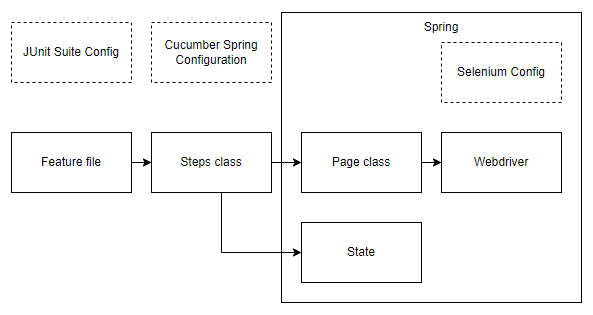

# Cucumber and Selenium

Time to make a BDD webdriver test. 
The goal of this chapter is to write a simple scenario that will execute a webdriver test.

## Context
We've seen several concepts when learning about Selenium and Cucumber.

The most important ones are:
- WebDriver
  - Tool to interact with the browser
- Page classes
  - The representation of a single web page in your code
- BDD steps
  - List of all actions you can use to run a scenario
- BDD Scenario
  - A single test case that exist of BDD steps
- Step class
  - Place where you define steps, usually grouping steps that are closely related together
- Feature files
  - Place where you can add scenarios

Besides these concepts we've seen how to configure different technologies:
- Maven
- JUnit Suite
- Spring Boot
- Selenium
- Cucumber

An overview 

## Example configuration
We've provided an example application. Take a look to make sure you understand everything that is going on.
Two additions have been made:
- The WebDriver bean has the annotation `@ScenarioScope` this will make sure the browser is restarted after every scenario
- In CucumberSpringConfiguration we've added an `@After` step. This will make sure the webdriver is exited properly after every scenario.
  - This was normally done by Spring but no longer works in combination with Cucumber

## Login Scenario

Write the code so that the following scenario on the [digibooky](https://training.switchfully.com/track/testing/digibooky) web application is automated:

```gherkin
  Scenario: I can log in
    Given I go to the login page
    And I fill in 'koen@mail.com' as username and 'passkoen' as password
    When When I press the login button
    Then I am navigated to the profile page
    And I can see that my inss is 1234567
```

1. Go through the scenario step by step. For every step:
   1. Add the line for that step to the feature file
   2. Write the code for the step definition in the step class (create a new step class if necessary)
   3. Add the necessary method(s) in the page class (create a new page class if necessary)
   4. Run your test. Check that the webdriver is doing the expected thing. Add a breakpoint and debug if you want to pause on a specific spot.

Congratulations, you've written your first scenario!

## Taking a screenshot
One thing that is still missing is the very useful feature of taking screenshot on failure.
How can we do this in Cucumber?
Cucumber has the principle of hooks. These allow you to execute code in certain phase of the Cucumber process.
Annotating a method with `@After` will tell cucumber to execute that method after every scenario. 
You'll even get a scenario object that will give you information of the scenario that was just executed.

1. In CucumberSpringConfiguration add an after-hook that will make a screenshot in case the scenario has failed.
   1. You can make use of the com.switchfully.selenium.webdriver.ScreenshotTaker component
2. Run your test. It should succeed. There is no screenshot in the target folder
3. Change the inss to check from 12345567 to 1234. Run your test again.
4. The test should fail and there should be a screenshot in your target folder.


